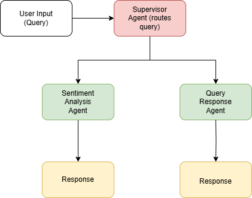
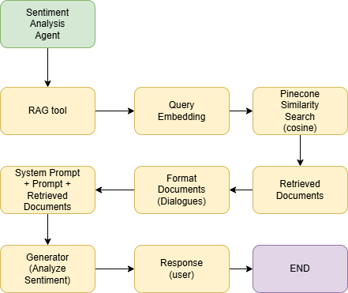
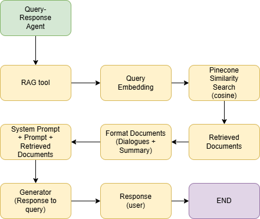

# Sentiment Analysis Chatbot - Comprehensive Architecture

## 1. Architectural Overview
The chatbot leverages a Graph RAG (Retrieval-Augmented Generation) architecture with multi-agent workflow, focusing on contextual sentiment analysis of dialogue scenes.

## 2. Technical Components

### 2.1 Frontend (React)
- Implements adaptive UI for text and voice inputs
- Manages real-time interaction state
- Handles ASR (Automatic Speech Recognition) integration

### 2.2 Backend (Flask)
- Implements rag_qa_api_stream endpoint
- Manages agent routing and workflow orchestration

### 2.3 LangGraph RAG Agents

#### Supervisor Agent:
- Determines query type and agent routing
- Implements dynamic workflow decision logic

#### Sentiment Analysis Agent:
- Extracts emotional context from dialogues
- Uses context-aware sentiment analysis

#### Query Response Agent:
- Retrieves relevant scene contexts
- Generates contextually rich responses

### 2.4 Embedding & Retrieval

#### Preprocessing:
- Scene-based chunking preserving dialogue integrity
- JSONL format for structured scene representation

#### Embedding Strategy:
- Cohere embed-english-v2.0 for vectorization
- Scene-level embedding to capture nuanced context

#### Retrieval Mechanism:
- Pinecone VectorDB for efficient storage
- Cosine similarity search for relevant scene retrieval

### 2.5 External Services
- AWS Bedrock: Advanced LLM access
- MongoDB Atlas: Conversation history storage
- Cohere Embeddings: Semantic vector generation

## 3. Advanced Features
- Cross-scene sentiment dependency tracking
- Dynamic agent collaboration
- Personalized response generation
- Voice input capabilities

## 4. Performance Considerations
- Optimized for low-latency retrieval
- Scalable agent-based architecture
- Flexible routing mechanisms

## 5. Future Enhancements
- Implement multi-language support
- Develop more granular sentiment scoring
- Enhance cross-agent communication protocols

The architecture diagram visualizes the intricate interactions between components, highlighting the dynamic, graph-based nature of the sentiment analysis chatbot.
